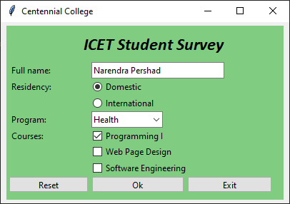
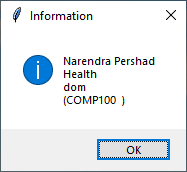

# Lab 4 -- Tkinter GUI Application

In this lab, we will build a simple graphical application that is
responsive and that uses basic widgets and demonstrates event handling.
The screen shot below the expected result. Please examine the rubrics in
building your GUI. Notice the widgets are not place directly on the form
but on a frame with width, padding and relief.

You must not use any other library except Tkinter. Your code must run on
a standard machine.

Your code must be written as a class that inherits from Tk and the
application must resize gracefully.

The apps must start in a usable state (i.e., all the relevant values of
the input widget must be set). So, if you click ok when the app starts,
then you should get the pop-up message shown in the last page. The reset
button must set the app to the initial start state.

## Due

See schedule for due date.



Widget must align vertically as well as horizontally with their matching
widget.

## Rubrics

| Marks | Task description |
|-------|------------------|
| -50   | - Application not designed as a class.<br>- Application not responsive: The widget does not move when the main window is resized.<br>- Application starts with missing input values. All the fields must be already filled out.<br>- Displaying a None value in your pop-up window. |
| 2     | Frame<br>Container for all of the widget. |
| 2     | Label for the name of the data-entry form |
| 4     | First column with the following labels:<br>- Full name<br>- Residency<br>- Program<br>- Courses<br>Color and font can be anything of your choice but must be pleasing to the user. |
| 3     | Entry that captures the username. |
| 6     | Radiobuttons:<br>- Domestic with value **dom**<br>- International with value **intl** |
| 5     | Combobox with minimum four items:<br>- AI, Gaming, Health, Software |
| 5     | Minimum three Checkboxes:<br>- Programming I with onvalue **COMP100** and offvalue ''<br>- Web Page Design with onvalue **COMP213** and offvalue ''<br>- Software Engineering with onvalue **COMP120** and offvalue '' |
| 2     | **Reset**<br>Resets/initialize the values in the form by calling the function at the end of this table |
| 2     | **Ok**<br>Calls a function that is described at the last but one of this table |
| 3     | **Exit**<br>Terminates the application |
| 7     | **Function**<br>Create and shows a messagebox with the information from the form as shown in the screenshot below.<br>This function is called by the Ok button |
| 6     | **Function**<br>Sets the form to a usable state. See the diagram above.<br>This function is called by the Reset button.<br>Can also be called in the constructor of the app. |
| 2     | **Resizing**<br>Position and size must adjust as the app window size changes. |
| 2     | **Aesthetics**<br>Must look pleasing to the user. |
|       | **Total: 50 Marks** |

## Pop-up Window



## Hints

You are asked to build the gui application shown below. You are advised
to examine the screenshot and plan your task accordingly

Use the following url to get coding hints and guidelines:

<https://likegeeks.com/python-gui-examples-tkinter-tutorial/>

<https://docs.python.org/3/library/tkinter.ttk.html>

<https://www.tutorialspoint.com/python/python_gui_programming.htm>

## Required Features/Functionalities

1. Should look as close to the image above as possible.

2. The widget must function as they would normally do.

3. The Reset button must reset all the widgets to its original state.

4. The Exit button must terminate the application.

5. When the Ok button is clicked the following pop-up window is
    displayed

#### Submission

1. Your code file will be named «your_first_name».py

2. Must be uploaded to course dropbox

## Appendix

`wk03c1_gui.py`

```python
# file: wk03c1_gui.py
# create a window with a single label

from tkinter import Tk
from tkinter.ttk import Label

root = Tk()
label = Label(root, text="Hello world")  # parent container  # to show on label
label.pack()

root.mainloop()
```

`wk03c1_gui_interest.py`

```python
# author : Narendra
# filename: wk03c1_gui_interest.py
# date: May 30, 2021

from tkinter import *
from tkinter.ttk import *


class InterestApp(Tk):

    def __init__(self, title):
        Tk.__init__(self)
        self.title(title)
        # Canvas(self, width=400, height=600).pack()
        # container = Frame(self)
        # container.place(relx=0.01, rely=0.01, relwidth=0.98, relheight=0.98)
        self.create_ui()
        # self.create_styles()
        # self.set_vars()
        style = Style()
        style.theme_use("clam")
        style.configure(".", bd=4, background="aquamarine", foreground="green")

    def create_ui(self, parent=None):
        if not parent:
            parent = self

        Label(parent, text="Begining Balance:").grid(
            sticky=E
        )  # must be aligned to the right
        Label(parent, text="Annual Interest Rate:").grid(row=1, sticky=E)
        Label(parent, text="Time:").grid(row=2, sticky=E)
        Label(parent, text="Compounding Period:").grid(row=3, sticky=E)
        Label(parent, text="End Balance:").grid(row=4, sticky=E)

        self.start_balance = DoubleVar()
        self.start_balance.set(1_000)
        Entry(parent, text="Starting Balance:", textvariable=self.start_balance).grid(
            row=0,  # goes into the first row
            column=1,  # goes into the second column
            columnspan=2,  # occupy 2 columns
            sticky=W,
        )  # must be aligned to the left
        self.interest_rate = DoubleVar()
        self.interest_rate.set(2.25)
        Entry(
            parent, text="Annual Interest Rate:", textvariable=self.interest_rate
        ).grid(columnspan=2, column=1, row=1, sticky=W)

        self.period = StringVar()
        self.combobox = Combobox(parent, textvariable=self.period)
        self.combobox["values"] = ("Year", "6 Months", "4 Months", "3 Months")
        self.combobox.grid(columnspan=2, column=1, row=2, sticky=W)
        self.period.set("Years")

        self.years = DoubleVar()
        Entry(parent, text="Years:", textvariable=self.years).grid(
            columnspan=2, column=1, row=3, sticky=W
        )
        self.end_balance = StringVar()
        Entry(
            parent,
            text="End Balance:",
            textvariable=self.end_balance,
            state=DISABLED,  # disables user interaction
        ).grid(columnspan=2, column=1, row=4, sticky=W)

        Button(parent, text="Calculate", command=self.calculate).grid(row=5, column=1)
        Button(parent, text="Exit", command=self.quit).grid(row=5, column=2)

        for child in parent.winfo_children():
            child.grid_configure(padx=5, pady=3)

    def calculate(self, *args):
        self.end_balance.set(
            f"${self.start_balance.get()} {self.interest_rate.get()} {self.period.get()} {self.years.get()}"
        )


app = InterestApp("Future Value Calculator")
app.mainloop()
```

`wk03c1_gui_all.py`

```python
# author : Narendra
# filename: wk03c1_gui_all.py
# date: May 30, 2021
# app to demonstrate the following widgets:
# Button, Label, Entry, Frame, Radiobutton,
# Combobox, LabelFrame, and Checkbutton
# using the pack layout manager

from tkinter import *
from tkinter.ttk import *


class MyApp(Tk):

    def __init__(self):
        Tk.__init__(self)
        self.title("All widgets")
        # Canvas(self, width=400, height=600).pack()
        # container = Frame(self)
        # container.place(relx=0.01, rely=0.01, relwidth=0.98, relheight=0.98)
        self.create_ui()
        self.create_styles()
        self.set_vars()

    def create_ui(self, parent=None):
        if not parent:
            parent = self
        Button(  # no way to easily change the text on this button
            parent,  # all widget needs a host container
            text="My Button",  # text to go on this widget
        ).pack()  # actually put this widget inside the host
        # you may also use grid or place
        Label(parent, text='Label "fill=X"').pack(
            fill=X
        )  # stretch this in the horizontal direction

        self.button_var = StringVar()  # there are also IntVar, BoolVar, DoubleVar
        self.button_var.set("Alternate button")
        Button(
            parent, textvariable=self.button_var  # this facilitates changing the text
        ).pack()

        self.label_var = StringVar()
        Label(parent, textvariable=self.label_var).pack()

        self.entry_var = StringVar()
        Entry(parent, textvariable=self.entry_var).pack()

        panel = Frame(relief=RAISED)  # create a container for some widgets
        self.vehicle = StringVar()
        Radiobutton(
            panel,  # this host container
            text="Honda",
            variable=self.vehicle,  # the variable that this widget works with
            value="honda",  # the value of the variable when this control is set
        ).pack()
        Radiobutton(panel, text="Toyota", variable=self.vehicle, value="toyota").pack()
        Radiobutton(panel, text="Ford", variable=self.vehicle, value="ford").pack()
        panel.pack(fill=X)  # stretch in the horizontal direction

        self.output = Text(  # this widget does not work with variables
            parent, height=5  # you must use get(), insert() and delete()
        )
        self.output.pack()

        self.colors = StringVar()
        self.combobox = Combobox(parent)
        self.combobox["values"] = ("Red", "Green", "Blue")
        self.combobox.pack()

        self.trudeau = StringVar()
        self.biden = StringVar()
        self.modi = StringVar()
        panel = LabelFrame(
            parent, text="Select your favorite leaders", relief=GROOVE
        )  # style for the border
        Checkbutton(
            panel,
            variable=self.trudeau,  # the variable that works with this control
            text="Mr. Trudeau",
            onvalue="justin_trudeau",  # value of the variable if checked
            offvalue="",  # value of the variable if unchecked
        ).pack()  # textvariable will allow you to change the text on this widget
        Checkbutton(
            panel,
            variable=self.biden,
            text="Mr. Biden",
            onvalue="joe_biden",
            offvalue="",
        ).pack()
        Checkbutton(
            panel,
            variable=self.modi,
            text="Mr. Modi",
            onvalue="narendra_modi",
            offvalue="",
        ).pack()
        panel.pack(
            fill=BOTH, expand=True  # stretch in both directions
        )  # expand if there is extra room

    def set_vars(self):
        self.label_var.set("Alternate label")
        self.entry_var.set("My entry")
        self.vehicle.set("toyota")
        self.trudeau.set("justin_trudeau")
        self.output.insert(
            1.0,
            """This is a long
long, long string.
It can go on forever
        """,
        )

    def create_styles(self):
        style = Style()
        style.theme_use("alt")
        style.configure(".", padding=(20, 10, 10, 10))  # , ipadding=(5, 5, 30, 40))


app = MyApp()  # instantiate the application
app.mainloop()  # run the event processing loop

```

`wk03c5_gui.py`

```python
from tkinter import *
from tkinter.ttk import *


class RegistrationApp(Tk):

    def __init__(self, title):
        Tk.__init__(self)  # call the base constructor
        self.title(title)  # sets the title of the main window

        self.iconbitmap("Internet.ico")

        sizer = Canvas(width=900, height=400)  # to force the size of the main window
        sizer.pack()

        container = Frame(self)
        container.place(
            relx=0.05,  ##distance from left of parent
            rely=0.05,  # distance from top of parent
            relwidth=0.9,  # width of the widget (relative to parent)
            relheight=0.9,
        )  # height of the widget (relative to parent)

        self.create_styles()
        self.create_ui(container)

    def create_styles(self):
        style = Style()
        style.configure("TFrame", background="sky blue", padding=(2, 2, 6, 6))
        style.configure("TLabel", background="#ff80c1", padding=(2, 2, 4, 4))
        style.configure(
            "TButton",
            background="gray",
            foreground="goldenrod",
            padding=(2, 2, 4, 4),
            ipadding=(5, 5, 5, 5),
        )

    def create_ui(self, parent):
        # 1st frame
        frame = Frame(parent)
        frame.place(relx=0.05, rely=0, relwidth=0.9, relheight=0.2)
        Label(frame, text="Registration Form", style="Heading.TLabel").pack(expand=True)
        # Label(frame, text='Registration Form', style='Heading.TLabel').place(relx=0.15, rely=0, relwidth=0.7, relheight=0.9)

        # 2nd frame
        frame = Frame(parent)
        frame.place(relx=0.05, rely=0.2, relwidth=0.9, relheight=0.6)
        # first column
        Label(frame, text="Name").place(relx=0, rely=0, relwidth=0.25, relheight=0.3)
        Label(frame, text="Program").place(
            relx=0, rely=0.33, relwidth=0.25, relheight=0.3
        )
        Label(frame, text="2nd row").place(
            relx=0, rely=0.66, relwidth=0.25, relheight=0.3
        )
        # Label(frame, text='2nd row').place(relx=0, rely=0, relwidth=0.45, relheight=0.3)

        # second column
        Entry(frame, text="2nd row").place(
            relx=0.25, rely=0, relwidth=0.5, relheight=0.3
        )
        Entry(frame, text="2nd row").place(
            relx=0.25, rely=0.33, relwidth=0.5, relheight=0.3
        )
        Entry(frame, text="2nd row").place(
            relx=0.25, rely=0.66, relwidth=0.5, relheight=0.3
        )

        # third column
        Label(frame, text="2nd row").place(
            relx=0.75, rely=0, relwidth=0.25, relheight=0.3
        )
        Label(frame, text="2nd row").place(
            relx=0.75, rely=0.33, relwidth=0.25, relheight=0.3
        )
        Label(frame, text="2nd row").place(
            relx=0.75, rely=0.66, relwidth=0.25, relheight=0.3
        )

        # 3th frame
        frame = Frame(parent)
        frame.place(relx=0.05, rely=0.8, relwidth=0.9, relheight=0.2)
        Button(frame, text="3rd row").place(
            relx=0.1, rely=0.1, relwidth=0.3, relheight=0.8
        )
        Button(frame, text="3rd row").place(
            relx=0.6, rely=0.1, relwidth=0.3, relheight=0.8
        )


# test harness
app = RegistrationApp("My Awesome GUI")
app.mainloop()
```
